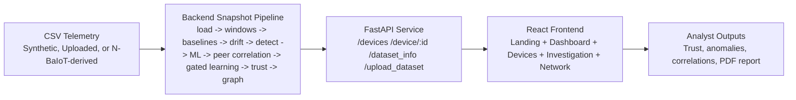

# Phantom Nexus

Phantom Nexus is a full-stack cybersecurity prototype for early detection of IoT botnet recruitment from network telemetry. The system ingests CSV telemetry, builds per-device behavior baselines, detects drift and suspicious recruitment patterns, scores trust, correlates peers, gates adaptive learning, and exposes the results through a SOC-style investigation dashboard.


## What The Current Prototype Does

Phantom Nexus answers these practical questions for each monitored IoT device:

1. What does normal behavior look like for this device?
2. Is the device drifting away from its baseline?
3. Are there signs of early botnet recruitment such as beaconing, unusual ports, or external outreach?
4. How risky is the device right now, and what trust score should it receive?
5. Are nearby devices showing coordinated suspicious behavior?
6. Should adaptive baseline learning stay enabled or be frozen?
7. How can an analyst export the findings into a report?

## Core Capabilities

- CSV telemetry ingestion and validation
- Drag-and-drop dataset upload from the frontend
- Feature engineering over per-device behavior and rolling windows
- Phantom Twin baseline modeling and digital twin views
- Drift detection using change-point analysis
- Hybrid botnet detection using both heuristics and an ML classifier
- Trust score computation on a 0-100 scale
- Peer correlation detection for coordinated suspicious activity
- Gated learning controls to freeze or roll back baseline updates
- Graph-based risk visualization across connected devices
- Device investigation views with LLM-assisted summaries
- Downloadable PDF investigation reports

## High-Level Architecture



## Backend Workflow

Whenever the active dataset changes, the backend rebuilds a fresh snapshot.

1. Load telemetry rows from the active CSV.
2. Validate required columns and normalize timestamp and numeric fields.
3. Aggregate flows into per-device time windows.
4. Build device behavioral baselines and digital twin context.
5. Detect behavioral drift using change-point analysis.
6. Run heuristic botnet detection over recent behavior.
7. Engineer device-level ML features and train a per-snapshot RandomForest classifier.
8. Merge heuristic and ML detections into a single device verdict.
9. Compute trust scores and trust histories.
10. Detect peer correlations and evaluate gated learning decisions.
11. Build the internal risk graph.
12. Generate explainability payloads, investigation data, and report content for the frontend.

## Current Backend Modules

### `backend/app/data_loader.py`

- Resolves the active dataset source.
- Validates telemetry schema.
- Normalizes timestamps and numeric columns.
- Supports synthetic, N-BaIoT-derived, and uploaded datasets.

### `backend/app/feature_engineering.py`

- Converts raw telemetry into time-windowed device features.
- Produces the rolling signals used for baselines, drift, and trust.

### `backend/app/phantom_twin.py`

- Builds per-device behavioral baselines.
- Produces digital twin views that compare observed behavior to expected behavior.

### `backend/app/drift_detection.py`

- Uses Ruptures to identify change points and drift severity.

### `backend/app/botnet_detector.py`

- Detects suspicious recruitment indicators such as:
  - new external IPs
  - suspicious ports
  - periodic beaconing
  - DNS anomalies
  - external outreach spikes

### `backend/app/ml_model.py`

- Engineers device-level behavioral features such as connection frequency, port entropy, beacon timing variance, and external IP diversity.
- Trains a snapshot-local `RandomForestClassifier`.
- Produces botnet probability and anomaly summary per device.

### `backend/app/peer_correlation.py`

- Finds coordinated suspicious behavior across devices.
- Produces correlation scores and correlated peer lists.

### `backend/app/gated_learning.py`

- Decides whether baseline learning should remain adaptive or be frozen.
- Uses trust score, active anomalies, peer correlation, and shadow-model divergence as gating signals.

### `backend/app/trust_engine.py`

- Computes trust score history, device status, and risk level.

### `backend/app/risk_graph.py`

- Builds a NetworkX graph of device relationships.
- Propagates local risk pressure across neighboring devices.

### `backend/app/explainability.py`

- Produces structured analyst-facing explanations.

### `backend/app/llm_explainer.py`

- Generates SOC-style security summaries using Groq when available.
- Falls back to a local heuristic summary if the LLM call fails.

### `backend/app/pdf_report_generator.py`

- Creates a PDF investigation report for a device using ReportLab.

### `backend/app/main.py`

- Orchestrates the full snapshot rebuild.
- Exposes the REST API.
- Handles CSV uploads and device report downloads.

## Frontend Workflow

The frontend presents the backend snapshot through four main views plus a landing page.

1. Landing page introduces the product and links into the command views.
2. Dashboard shows fleet posture, trust trajectory, risk distribution, and the network graph.
3. Devices page shows the active dataset, supports CSV upload, and lists the fleet.
4. Device Investigation page shows trust gauge, anomaly breakdown, peer correlations, gated learning state, LLM narrative, and PDF export.
5. Network Map shows the graph-oriented view of device relationships and propagation context.

The current UI ships as a dark command-center style interface. The earlier light/dark theme toggle is no longer part of the present prototype.

## Current Frontend Modules

### `frontend/src/App.jsx`

- Defines the routes:
  - `/`
  - `/dashboard`
  - `/devices`
  - `/devices/:deviceId`
  - `/network`

### `frontend/src/components/Navbar.jsx`

- Top navigation for the landing, dashboard, devices, and network views.

### `frontend/src/components/FileUpload.jsx`

- Drag-and-drop CSV upload with progress tracking.
- Calls the backend upload API and refreshes the dataset snapshot.

### `frontend/src/components/DeviceTable.jsx`

- Fleet watchlist table for device trust and anomaly posture.

### `frontend/src/components/TrustScoreChart.jsx`

- Recharts-based trust history visualization.

### `frontend/src/components/NetworkGraph.jsx`

- React Flow graph for network and propagation context.

### `frontend/src/pages/Landing.jsx`

- Product entry page and feature overview.

### `frontend/src/pages/Dashboard.jsx`

- Fleet overview, aggregate trust trend, risk distribution, priority queue, and graph preview.

### `frontend/src/pages/Devices.jsx`

- Device fleet view plus active dataset metadata and upload controls.

### `frontend/src/pages/DeviceInvestigation.jsx`

- Deep investigation page for one device.
- Includes anomaly chart, peer correlations, learning state, LLM explanation, and PDF report download.

### `frontend/src/pages/NetworkMap.jsx`

- Dedicated graph-centric visualization page.

### `frontend/src/services/api.js`

- Central frontend API wrapper.

## REST API

The backend currently exposes these endpoints:

- `GET /`
- `GET /devices`
- `GET /trust_scores`
- `GET /drift`
- `GET /risk_graph`
- `GET /digital_twins`
- `GET /peer_correlations`
- `GET /dataset_info`
- `GET /device/{device_id}`
- `POST /upload_dataset`
- `GET /device_investigation/{device_id}`
- `GET /device_report/{device_id}`

## Data Model

### Required Input Columns

- `device_id`
- `timestamp`
- `src_ip`
- `dest_ip`
- `dest_port`
- `protocol`
- `bytes`
- `packets`

### ML Feature Set

The current ML model uses 10 engineered device-level features:

- `connection_frequency`
- `unique_dest_ips`
- `avg_bytes`
- `avg_packets`
- `port_entropy`
- `time_of_day_activity`
- `beacon_interval_std`
- `external_ip_diversity`
- `suspicious_port_ratio`
- `off_hours_activity`

### Primary Device Outputs

- trust score
- risk level
- drift score
- botnet probability
- anomaly score
- anomaly list
- peer correlation score
- gated learning state
- LLM explanation
- PDF investigation report

## Detection and ML Design

Phantom Nexus currently uses a hybrid detection design:

- Heuristics identify explicit suspicious patterns such as beaconing, suspicious ports, and new external destinations.
- A `RandomForestClassifier` adds a behavior-based probability score using engineered device-level features.
- The final device verdict merges the heuristic and ML outputs.

The model is trained per snapshot rather than as a long-lived pre-trained artifact. This keeps the prototype responsive to uploaded datasets and demo refreshes.

## Dataset Support

No dataset CSV files are committed to this repository. You must either generate the synthetic demo dataset locally or download and preprocess the N-BaIoT dataset before running the backend.

### 1. Synthetic Demo Dataset

Default source: `backend/dataset/iot_sample.csv`

Generated by:

- `backend/scripts/generate_demo_dataset.py`

This dataset is designed to surface demo-worthy incidents in the latest windows.

### 2. Uploaded CSV Datasets

- Uploaded through the Devices page.
- Stored under `backend/dataset/uploads/`.
- Automatically validated and used as the new active dataset.

### 3. N-BaIoT-Derived Dataset

Optional source: `backend/dataset/iot_sample_n_baiot.csv`

Generated from the raw N-BaIoT data using:

- `backend/scripts/preprocess_n_baiot.py`

The preprocessing script maps the source data into the backend telemetry schema and injects late suspicious windows so the prototype remains visually useful during demos.

The raw dataset is not stored in this repository. Download it yourself before preprocessing.

## Project Structure

```text
MahaDEVS_Phantom-Nexus/
├── backend/
│   ├── app/
│   │   ├── __init__.py
│   │   ├── botnet_detector.py
│   │   ├── data_loader.py
│   │   ├── drift_detection.py
│   │   ├── explainability.py
│   │   ├── feature_engineering.py
│   │   ├── gated_learning.py
│   │   ├── llm_explainer.py
│   │   ├── main.py
│   │   ├── ml_model.py
│   │   ├── pdf_report_generator.py
│   │   ├── peer_correlation.py
│   │   ├── phantom_twin.py
│   │   ├── risk_graph.py
│   │   └── trust_engine.py
│   ├── dataset/
│   │   ├── iot_sample.csv
│   │   ├── iot_sample_n_baiot.csv
│   │   └── uploads/
│   ├── scripts/
│   │   ├── generate_demo_dataset.py
│   │   └── preprocess_n_baiot.py
│   └── requirements.txt
├── datasets/
│   └── n-baiot/
├── frontend/
│   ├── public/
│   ├── src/
│   │   ├── components/
│   │   ├── pages/
│   │   ├── services/
│   │   ├── App.jsx
│   │   ├── index.css
│   │   └── main.jsx
│   ├── index.html
│   ├── package.json
│   ├── postcss.config.js
│   ├── tailwind.config.js
│   └── vite.config.js
├── start.ps1
├── test_groq.py
└── README.md
```

## Tech Stack

### Backend

| Technology | Used For |
|---|---|
| Python | Backend logic and analytics pipeline |
| FastAPI | REST API layer |
| Pandas | CSV loading and feature aggregation |
| NumPy | Numerical scoring helpers |
| scikit-learn | RandomForest-based device classifier |
| Ruptures | Drift detection |
| NetworkX | Device relationship graph |
| ReportLab | PDF report generation |
| Groq | Optional LLM-generated investigation summaries |
| Uvicorn | ASGI development server |

### Frontend

| Technology | Used For |
|---|---|
| React | UI composition |
| Vite | Development and build pipeline |
| React Router | App routing |
| Tailwind CSS | Styling and layout |
| Bootstrap | Selective UI utility styling |
| Recharts | Charts |
| React Flow (`@xyflow/react`) | Network visualization |
| `react-dropzone` | Drag-and-drop dataset upload |

## Getting Started

### Prerequisites

- Python 3.10 or higher
- Node.js 18 or higher
- npm

### 1. Clone the repository

```powershell
git clone https://github.com/PriyankaB-11/Eclipse_MahaDEVS_PhantomNexus.git
cd Eclipse_MahaDEVS_PhantomNexus
```

### 2. Create and activate a virtual environment

```powershell
python -m venv .venv
.venv\Scripts\Activate.ps1
```

### 3. Install backend dependencies

```powershell
cd backend
pip install -r requirements.txt
cd ..
```

### 4. Install frontend dependencies

```powershell
cd frontend
npm install
cd ..
```

### 5. Choose and prepare a dataset

The project does not ship with dataset CSVs. Pick one of these setup paths before starting the backend.

#### Option A: Generate the synthetic demo dataset locally

```powershell
cd backend
python scripts/generate_demo_dataset.py
cd ..
```

This creates `backend/dataset/iot_sample.csv` and is the fastest way to run the prototype.

#### Option B: Download and preprocess the N-BaIoT dataset

1. Download the raw N-BaIoT dataset from the UCI repository.
2. Extract the files into `datasets/n-baiot/`.
3. Run the preprocessor:

```powershell
python backend/scripts/preprocess_n_baiot.py
```

This creates `backend/dataset/iot_sample_n_baiot.csv`.

### 6. Start the application

You can either launch both services with the helper script or run them separately.

#### Option A: Use the helper script

```powershell
.\start.ps1
```

This opens:

- Backend: `http://127.0.0.1:8000`
- Frontend: `http://localhost:5173`

#### Option B: Run services manually

Backend:

```powershell
cd backend
$env:PHANTOM_DATA_SOURCE = "synthetic"
uvicorn app.main:app --reload --host 127.0.0.1 --port 8000
```

If you prepared the N-BaIoT dataset instead, switch the source before starting the backend:

```powershell
cd backend
$env:PHANTOM_DATA_SOURCE = "n_baiot"
uvicorn app.main:app --reload --host 127.0.0.1 --port 8000
```

Frontend:

```powershell
cd frontend
npm run dev
```

## Frontend Pages

| Page | Route | Purpose |
|---|---|---|
| Landing | `/` | Product entry point and overview |
| Dashboard | `/dashboard` | Fleet metrics, trust trend, risk distribution, graph preview |
| Devices | `/devices` | Device list, active dataset metadata, CSV upload |
| Device Investigation | `/devices/:deviceId` | Deep dive into one device |
| Network Map | `/network` | Graph-oriented relationship view |

## Environment Variables

| Variable | Default | Description |
|---|---|---|
| `PHANTOM_DATA_SOURCE` | `synthetic` | Dataset source: `synthetic` or `n_baiot` |
| `VITE_API_BASE_URL` | `http://127.0.0.1:8000` | Frontend API base URL |
| `GROQ_API_KEY` | unset in recommended setup | Optional Groq key for LLM summaries |

If `GROQ_API_KEY` is not set, the backend falls back to a local heuristic summary generator.

Example:

```powershell
$env:PHANTOM_DATA_SOURCE = "n_baiot"
cd backend
uvicorn app.main:app --reload
```

## N-BaIoT Workflow

If you want to run the prototype on the N-BaIoT dataset:

1. Download the raw dataset from the UCI repository.
2. Extract it into `datasets/n-baiot/`.
3. Run the preprocessor.
4. Start the backend with `PHANTOM_DATA_SOURCE=n_baiot`.

The downloaded raw dataset stays local and should not be committed.

Preprocessing command:

```powershell
python backend/scripts/preprocess_n_baiot.py
```

This generates `backend/dataset/iot_sample_n_baiot.csv`.

## Current Limitations

- The primary workflow is snapshot-based, not streaming.
- The ML model is intentionally lightweight and retrained per snapshot.
- Uploaded datasets must match the required telemetry schema.
- The prototype is optimized for explainability and demo flow rather than production-scale model management.
- Groq summaries are best treated as optional enrichment; the backend can fall back to heuristic narrative generation.

## Summary

Phantom Nexus currently combines telemetry ingestion, behavioral baselining, drift detection, hybrid botnet scoring, trust analytics, peer correlation, gated learning, graph context, device investigation, LLM-assisted explanation, and PDF export into a single demo-ready security prototype.
