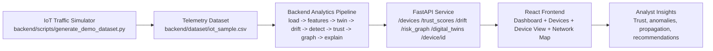

# Phantom Nexus

Phantom Nexus is a full-stack cybersecurity prototype for detecting early-stage IoT botnet recruitment from network telemetry. It simulates benign and malicious IoT traffic, builds a behavioral twin for every device, detects drift from expected behavior, computes trust scores, propagates network risk across device relationships, and visualizes everything in an analyst-facing dashboard.

This project is designed as a hackathon prototype, so the focus is:

- clear architecture
- modular backend pipeline
- demo-ready simulation data
- usable frontend workflow for presenting the idea live

## What The System Does

Phantom Nexus monitors device communication flows and answers six practical questions:

1. What does normal behavior look like for each IoT device?
2. Is the current device behavior drifting from its normal baseline?
3. Are there signals of botnet recruitment such as beaconing, suspicious ports, or new external endpoints?
4. How trustworthy is each device right now?
5. If one device becomes risky, how much nearby risk should propagate to related devices?
6. How can the analyst explain the decision in a simple, action-oriented report?

## Core Capabilities

- IoT telemetry ingestion from CSV
- Feature engineering over time windows
- Per-device Phantom Twin baseline modeling
- Digital twin generation for every device
- Drift detection using change-point analysis
- Botnet recruitment scoring using rule-based indicators
- Trust score computation on a 0-100 scale
- Risk propagation across an internal device graph
- Explainability reports for SOC-style triage
- Interactive frontend dashboard with charts, tables, device detail views, and network graph visualization
- Light and dark theme support with runtime theme toggle

## Tech Stack

### Backend Stack (What It Is Used For)

| Technology | Used For | Why It Was Chosen |
|---|---|---|
| Python | Core backend language and analytics logic | Fast prototyping and strong data ecosystem |
| FastAPI | REST API layer (`/devices`, `/risk_graph`, `/device/{id}`, etc.) | Very fast to build typed APIs and easy frontend integration |
| Pandas | Loading CSV telemetry and feature aggregation | Best fit for table/time-window transformations |
| NumPy | Numerical operations for scoring and normalization | Lightweight and efficient numerical toolkit |
| Ruptures | Change-point based drift detection | Purpose-built library for behavioral drift segmentation |
| NetworkX | Communication graph and trust propagation modeling | Simple graph primitives and easy JSON export |
| scikit-learn | ML-ready extension layer for future classifier experiments | Standard ML toolkit for rapid experimentation |
| Uvicorn | ASGI server to run FastAPI | Reliable dev server with FastAPI-first support |

### Frontend Stack (What It Is Used For)

| Technology | Used For | Why It Was Chosen |
|---|---|---|
| React | UI component system and page composition | Fast iteration, modular components, strong ecosystem |
| Vite | Frontend dev/build pipeline | Very fast startup and build feedback loop |
| React Router | Multi-page navigation (Dashboard, Devices, Device View, Network Map) | Clean client-side routing for app-style UX |
| Tailwind CSS | Utility-first styling and responsive layout | Rapid visual development with consistent spacing/typography |
| Bootstrap (selective) | Small UI utility usage (buttons and quick polish) | Speeds up prototype delivery for common controls |
| Recharts | Trust trend and risk distribution charts | Easy React-native charting with good defaults |
| React Flow (`@xyflow/react`) | Interactive risk propagation graph + minimap | Built specifically for interactive node/edge network views |

### Tooling

| Tool | Used For |
|---|---|
| PostCSS + Autoprefixer | Tailwind processing and CSS compatibility |
| npm | Frontend dependency and script management |
| pip | Backend dependency management |

## High-Level Architecture



## Backend Workflow

When the backend snapshot is rebuilt, the pipeline works in this order:

1. Load telemetry rows from CSV.
2. Convert timestamps and normalize numeric fields.
3. Aggregate traffic into per-device time windows.
4. Compute device behavioral features.
5. Build Phantom Twin baselines for each device.
6. Detect behavioral drift using change points.
7. Score recruitment indicators using rule-based botnet detection.
8. Calculate trust scores and trust history.
9. Build a communication graph and propagate trust decay.
10. Produce explainability and digital twin output for the frontend.

## Backend Module Responsibilities

### `backend/app/data_loader.py`

- Loads the CSV dataset.
- Parses timestamps.
- Normalizes numeric telemetry fields.
- Maps device IDs to internal IPs.

### `backend/app/feature_engineering.py`

- Converts raw flow rows into time-windowed features per device.
- Computes:
  - flow frequency
  - unique destination count
  - average bytes per flow
  - average packets per flow
  - unique port count
  - DNS query count
  - external connection ratio
  - off-hours activity ratio
  - dominant activity hour
  - destination list
  - port list
  - internal target list

### `backend/app/phantom_twin.py`

- Builds behavioral baselines for each device.
- Creates digital twins that compare current behavior to the baseline.
- Digital twin output includes:
  - behavioral state
  - confidence
  - baseline profile
  - observed profile
  - deviations
  - threat overlay

### `backend/app/drift_detection.py`

- Detects change points across time-windowed device signals.
- Uses Ruptures to compute drift score and signal-level breakdown.

### `backend/app/botnet_detector.py`

- Detects likely recruitment indicators such as:
  - new external IPs
  - suspicious ports
  - periodic beaconing
  - DNS anomalies
  - external outreach spikes

### `backend/app/trust_engine.py`

- Computes trust score history per device.
- Produces final current trust score, status, and risk level.

### `backend/app/risk_graph.py`

- Builds a NetworkX directed graph from internal communication flows.
- Applies trust decay to neighbors of critical nodes.
- Returns graph-friendly node/edge JSON.

### `backend/app/explainability.py`

- Produces structured analyst-facing decision output.
- Converts signals into recommended action text.

### `backend/app/main.py`

- Orchestrates the full snapshot build.
- Exposes REST endpoints.
- Enables CORS for frontend access.

## Frontend Workflow

The frontend consumes API endpoints and converts them into analyst-facing views:

1. Dashboard shows top-line health metrics, trust trajectory, pie distribution, priority queue, and network graph.
2. Devices page provides a sortable incident-style watchlist view.
3. Device View shows trust history, anomalies, explanation, and digital twin state.
4. Network Map shows propagation behavior across internal device relationships.
5. Navbar theme toggle switches between light and dark themes globally.

## Frontend Module Responsibilities

### `frontend/src/App.jsx`

- Main router shell.
- Persists global light/dark theme state.

### `frontend/src/components/Navbar.jsx`

- Top-level navigation.
- Theme toggle control.

### `frontend/src/components/DeviceTable.jsx`

- Fleet watchlist table for device trust and status.

### `frontend/src/components/TrustScoreChart.jsx`

- Recharts-based trust timeline visualization.

### `frontend/src/components/NetworkGraph.jsx`

- React Flow-powered propagation visualization.
- Supports minimap, drag/pan/zoom interactivity, and theme-aware rendering.

### `frontend/src/components/DeviceDetail.jsx`

- Renders device investigation content:
  - trust overview
  - anomalies
  - recommended action
  - evidence ledger
  - digital twin summary

### `frontend/src/pages/Dashboard.jsx`

- Overall fleet summary page.

### `frontend/src/pages/Devices.jsx`

- Fleet watchlist page.

### `frontend/src/pages/DeviceView.jsx`

- Per-device investigation page.

### `frontend/src/pages/NetworkMap.jsx`

- Dedicated risk propagation view.

### `frontend/src/services/api.js`

- Centralized frontend API layer.

## Project Structure

```text
phantom-nexus/
├── backend/
│   ├── app/
│   │   ├── __init__.py
│   │   ├── botnet_detector.py
│   │   ├── data_loader.py
│   │   ├── drift_detection.py
│   │   ├── explainability.py
│   │   ├── feature_engineering.py
│   │   ├── main.py
│   │   ├── phantom_twin.py
│   │   ├── risk_graph.py
│   │   └── trust_engine.py
│   ├── dataset/
│   │   └── iot_sample.csv
│   ├── scripts/
│   │   └── generate_demo_dataset.py
│   └── requirements.txt
├── frontend/
│   ├── public/
│   ├── src/
│   │   ├── components/
│   │   ├── pages/
│   │   ├── services/
│   │   ├── App.jsx
│   │   ├── index.css
│   │   └── main.jsx
│   ├── index.html
│   ├── package.json
│   ├── postcss.config.js
│   ├── tailwind.config.js
│   └── vite.config.js
├── .gitignore
└── README.md
```

## Data Model

### Input Telemetry Columns

- `device_id`
- `timestamp`
- `src_ip`
- `dest_ip`
- `dest_port`
- `protocol`
- `bytes`
- `packets`

### Derived Features

- flow frequency per device/time window
- unique destination count
- unique ports count
- average bytes per flow
- average packets per flow
- DNS query count
- external connection ratio
- off-hours ratio
- port distribution

### Device Risk Outputs

- trust score
- risk level
- drift score
- botnet probability
- anomaly list
- explanation report
- digital twin state
- propagated trust on graph neighbors

## Digital Twin Implementation

Each device gets a digital twin derived from its baseline and latest observed behavior.

The digital twin contains:

- `behavioral_state`
  - `stable`, `degraded`, or `compromised`
- `confidence`
  - confidence in the twin state derived from drift level
- `baseline_profile`
  - learned normal behavior for that device
- `observed_profile`
  - current observed behavior from the latest window
- `deviations`
  - how far current behavior is from expected behavior
- `threat_overlay`
  - trust, drift, botnet probability, and anomalies

This is implemented in `backend/app/phantom_twin.py` and returned via `GET /digital_twins` and `GET /device/{device_id}`.

## Trust Scoring Logic

Trust starts from an assumed healthy baseline and is reduced by observed risk signals.

Primary trust deductions come from:

- deviation from historical flow frequency
- new or unexpected destinations
- new or unexpected ports
- off-hours behavior
- elevated DNS anomalies
- external outreach spikes
- drift score
- botnet probability

Final trust is clamped between 0 and 100.

Risk interpretation:

- `safe`: 70-100
- `warning`: 40-69
- `critical`: 0-39

## Risk Propagation Logic

The graph represents internal device-to-device communication relationships.

- Nodes are devices.
- Edges are internal communication flows.
- Critical devices propagate a trust decay penalty to direct neighbors.
- The frontend shows both original trust and propagated trust.

This is intended to model local blast radius rather than global infection certainty.

## Explainability Workflow

Each device detail page includes a structured explanation with:

- trust score
- anomaly reasons
- evidence values
- recommended action

Example recommendation outcomes:

- continue baseline monitoring
- increase monitoring and validate recent connections
- segment device and inspect outbound destinations
- quarantine device

## REST API

### `GET /`

Returns a health-style message indicating the backend is running.

### `GET /devices`

Returns summarized fleet device records for watchlist and dashboard views.

### `GET /trust_scores`

Returns trust history per device for charting.

### `GET /drift`

Returns drift scores and signal breakdowns.

### `GET /risk_graph`

Returns graph nodes and edges for the propagation visualization.

### `GET /digital_twins`

Returns digital twin payloads for all devices.

### `GET /device/{device_id}`

Returns the full detail payload for one device, including:

- summary
- trust history
- drift
- detection
- explanation
- phantom twin baseline
- digital twin

## Demo Dataset and Simulation

The demo dataset is generated by:

- `backend/scripts/generate_demo_dataset.py`

It creates:

- normal traffic for multiple IoT device types
- late-stage injected malicious behavior so the dashboard has active incidents in the latest windows
- internal propagation-like flows between compromised and neighboring devices

The default simulation currently highlights:

- `camera_01` as critical
- `speaker_01` as critical
- `sensor_01` as warning

## N-BaIoT Dataset Workflow

You can run the backend with either:

- synthetic demo telemetry (`backend/dataset/iot_sample.csv`)
- preprocessed N-BaIoT telemetry (`backend/dataset/iot_sample_n_baiot.csv`)

### 1. Extract N-BaIoT archive

```powershell
Set-Location .
python -c "import zipfile, pathlib; z=zipfile.ZipFile('datasets/n-baiot.zip'); out=pathlib.Path('datasets/n-baiot'); out.mkdir(parents=True, exist_ok=True); z.extractall(out)"
```

### 2. Preprocess N-BaIoT into backend telemetry format

```powershell
Set-Location .
python backend/scripts/preprocess_n_baiot.py
```

This creates:

- `backend/dataset/iot_sample_n_baiot.csv`

The preprocessing script maps N-BaIoT statistical features into the backend schema:

- `device_id`, `timestamp`, `src_ip`, `dest_ip`, `dest_port`, `protocol`, `bytes`, `packets`

It can also inject attack-like windows at the end of selected device timelines so trust degradation remains visible for demos.

### 3. Switch backend source

Use `PHANTOM_DATA_SOURCE` before starting FastAPI:

```powershell
# Synthetic demo data (default)
$env:PHANTOM_DATA_SOURCE = "synthetic"

# Preprocessed N-BaIoT data
$env:PHANTOM_DATA_SOURCE = "n_baiot"

Set-Location .\backend
uvicorn app.main:app --reload
```

## Local Development Workflow

### 1. Start the backend

```powershell
Set-Location .\backend
pip install -r requirements.txt
python scripts/generate_demo_dataset.py
uvicorn app.main:app --reload
```

Backend runs at:

- `http://127.0.0.1:8000`

### 2. Start the frontend

```powershell
Set-Location .\frontend
npm install
npm run dev
```

Frontend usually runs at:

- `http://127.0.0.1:5173`

### 3. Optional frontend production build

```powershell
Set-Location .\frontend
npm run build
```

## Environment Notes

- The frontend reads `VITE_API_BASE_URL` if you want to point it to a different backend URL.
- If `VITE_API_BASE_URL` is not set, it defaults to `http://127.0.0.1:8000`.
- The backend reads `PHANTOM_DATA_SOURCE` with supported values: `synthetic` or `n_baiot`.

## Demo Presentation Workflow

Recommended live demo sequence:

1. Start backend and frontend.
2. Open Dashboard to show total devices, risky devices, and average trust score.
3. Highlight the risk distribution chart.
4. Open Devices and point out critical rows.
5. Open `camera_01` or `speaker_01` in Device View.
6. Explain the digital twin deviations and recommendation.
7. Open Network Map to show propagated trust decay.
8. Toggle light/dark mode to demonstrate polished UI behavior.

## Dependencies

### Backend dependencies

```text
fastapi>=0.129.0,<0.130.0
uvicorn>=0.41.0,<0.42.0
pandas>=2.3.3,<2.4.0
numpy>=2.4.0,<2.5.0
scikit-learn>=1.8.0,<1.9.0
ruptures>=1.1.10,<1.2.0
networkx>=3.6.1,<3.7.0
python-multipart>=0.0.22,<0.1.0
```

### Frontend dependencies

```text
react
react-dom
react-router-dom
@xyflow/react
recharts
bootstrap
vite
tailwindcss
postcss
autoprefixer
```

## Build Status

Validated locally:

- backend snapshot pipeline builds successfully
- frontend production build completes successfully
- REST endpoints return expected data
- graph interactivity and minimap behavior are wired into persistent React Flow state
- global light/dark theme toggle is implemented in the frontend shell

## Known Limitations

- The dataset is simulated, not production telemetry.
- Detection logic is intentionally interpretable and lightweight, not production-grade ML.
- Risk propagation is local-neighbor based and does not yet model multi-hop infection probabilities.
- Frontend build reports a bundle size warning, but the app builds and runs correctly.

## Future Improvements

- Add live streaming updates instead of static snapshot refresh.
- Add filtering, sorting, and export controls in the watchlist.
- Add auto-layout for the network graph.
- Add authentication and user roles.
- Add model training and evaluation workflow for more advanced botnet classification.
- Add websocket-based real-time dashboard updates.

## Summary

Phantom Nexus combines telemetry analysis, behavioral baselining, digital twins, drift detection, trust scoring, propagation modeling, and analyst-facing visualization into a single end-to-end prototype. It is structured to be understandable in a hackathon setting while still feeling like a realistic security analytics workflow.
